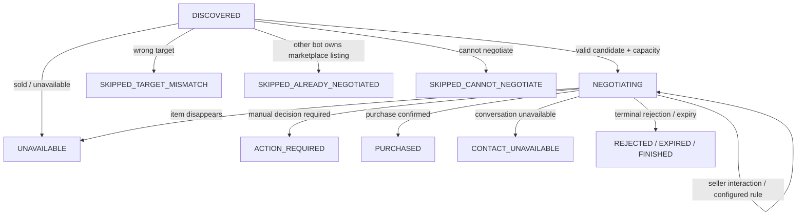
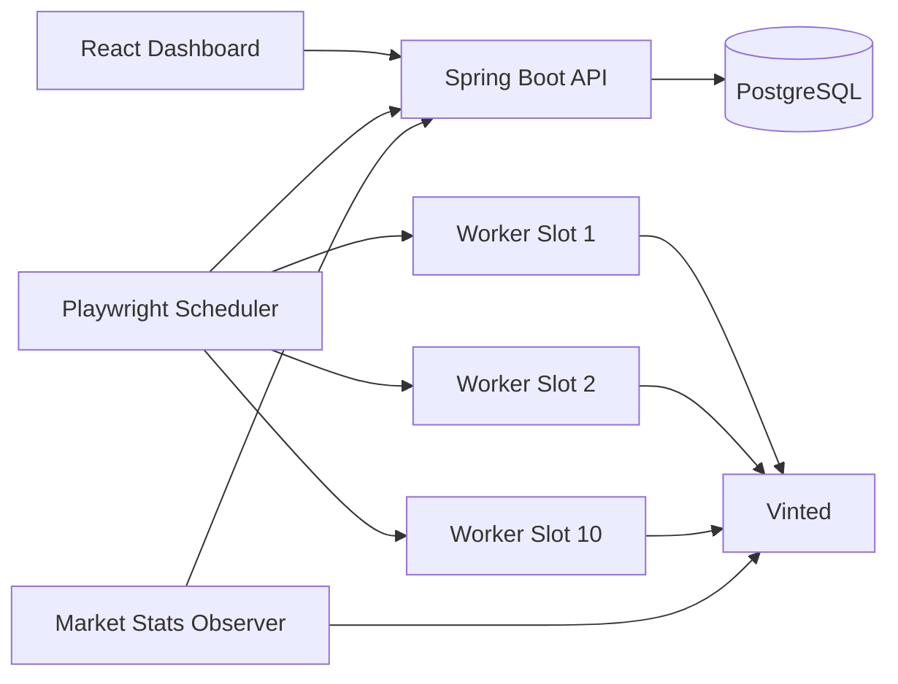

# FlipBot — Marketplace Monitoring & Negotiation Automation

<p align="center">
  <strong>A stateful full-stack automation system for discovering marketplace listings, validating targets, coordinating parallel browser workers and executing guarded multi-step negotiations.</strong>
</p>

<p align="center">
  <a href="../../actions/workflows/ci.yml"></a>
  
  
  
  
  
</p>

> **Project status:** active development. FlipBot is an independent engineering project and is not affiliated with, endorsed by or sponsored by Vinted. Browser automation may be subject to marketplace rules and account restrictions; use responsibly.

---

## Demo

<p align="center">
  <a href="https://www.youtube.com/watch?v=xaNDLMsuKKk">
    
  </a>
</p>

<p align="center">
  <strong>▶ <a href="https://www.youtube.com/watch?v=xaNDLMsuKKk">Watch the full 2:34 FlipBot demo on YouTube</a></strong>
</p>

The demo shows the **real application**, not a mock-up or isolated browser script. It walks through the dashboard, bot configuration, persisted history, the parallel Playwright runtime and live runtime telemetry.

| Approx. time | What is shown |
| --- | --- |
| **0:05** | dashboard with running bots, negotiation counts, purchases and business metrics |
| **0:25** | bot configuration: Vinted account, target filters, model, price range and negotiation rules |
| **0:50** | persisted listing / purchase history |
| **1:15** | transition from the dashboard to the live automation engine |
| **1:40** | **10 headless Playwright browser slots** and parallel-worker architecture |
| **2:05** | runtime observability: working, queued, cooldown and error states |
| **2:28** | UI state changing alongside the worker logs |

The full-resolution recording stays on YouTube rather than in Git history, keeping the repository lightweight while still providing an immediate visual proof that the system works end to end.

### What the demo proves

FlipBot is more than a scraper or a Selenium-style script. The browser engine, backend state, scheduler, persistent safety guards and dashboard operate as one coordinated system.

---

## What is FlipBot?

FlipBot is a monorepo for **stateful marketplace automation**. It continuously discovers listings, verifies that they really match a configured target, tracks market activity, plans negotiation capacity and can execute multi-step price negotiations through isolated Playwright workers.

The main design goal is not just automation speed. It is **correctness under unstable browser UI, retries, parallel workers and persistent business state**.

The system is split into four cooperating layers:

- **Spring Boot backend** — source of truth for bots, listings, negotiation state, quotas, runtime telemetry, marketplace ownership and action audit.
- **Java Playwright runtime** — scheduled browser workers for catalog discovery, price probes and negotiation checks.
- **React dashboard** — operational UI for bot configuration, runtime monitoring, history, action-required items, dictionaries and pricing.
- **PostgreSQL** — durable state for listings, negotiations, runtime, market statistics and safety guards.

---

## Core capabilities

### Marketplace discovery

Each bot can scan Vinted using a configured target, price range and category path. Discovery is persisted in the backend instead of living only in browser memory.

The backend deliberately keeps historical records: a listing does not become “new again” simply because a worker restarts.

### Two target modes

FlipBot explicitly separates two target-identification strategies.

#### `VINTED_MODEL`

Used when Vinted exposes a native model filter.

- category and brand are selected first,
- the model must be proven as an **exact visible Vinted option**,
- similar variants such as `Ultra`, `FE`, `Edge` or `+` are not accepted as substitutes,
- the selected model collection is verified after navigation,
- fresh-scan provenance is used as strong evidence only when the listing actually came from the current exact filtered result set.

#### `SEARCH_QUERY`

Used when a native Vinted model filter is not suitable.

- the requested model is entered into marketplace search,
- category / brand / price constraints are still applied,
- title, URL and — when required — the live item page are used for semantic verification,
- common wrong generations, variants and accessories are rejected.

### Live target verification before real actions

A stored listing title is not enough to justify a real offer. Before a first offer, the Playwright layer can re-check live Vinted evidence such as structured **brand/model fields** and the item heading.

Conclusive mismatches fail closed and become `SKIPPED_TARGET_MISMATCH` rather than risking a negotiation for the wrong product.

---

## Negotiation engine

Listings move through a persistent lifecycle instead of being disposable scraper output.



The backend remembers, among other things:

- marketplace listing ID,
- internal backend listing ID,
- Vinted conversation ID and URL,
- current negotiation step,
- original and current price,
- current step start time,
- seller/read activity timestamps,
- formal seller responses and counteroffers,
- whether a seller response is still awaited,
- confirmed real actions and marketplace ownership.

A browser job can therefore finish, the process can restart, and a later scheduled job can continue the same negotiation from PostgreSQL.

### Configurable reactions

Negotiation steps support different reactions to seller behavior. Examples include:

- send the next configured step immediately,
- wait before the next step,
- react differently to a seller's own counter-price,
- apply percentage thresholds against the original listing price,
- stop when there is no following negotiation step.

Timing decisions are persisted rather than tied to one browser process.

---

## Cross-bot negotiation ownership

Multiple bots may discover the same marketplace listing. FlipBot prevents them from independently starting or continuing duplicate real negotiations.

The backend keeps a durable ownership record keyed by:

```text
(marketplace, marketplace_listing_id)
```

The important behavior is:

1. a `FIRST_OFFER` attempts a **pre-submit marketplace claim**,
2. a competing bot is blocked while that reservation exists,
3. a successfully confirmed first offer makes the claim durable,
4. an unconfirmed pre-submit failure releases only its own reservation,
5. later `NEXT_STEP` actions must still belong to the same marketplace owner,
6. a duplicate backend listing owned by another confirmed conversation becomes `SKIPPED_ALREADY_NEGOTIATED`.

This is separate from the per-listing action guard and protects the real marketplace conversation globally across bots.

---

## Real-action safety

Real marketplace clicks are treated as transactional operations, not casual UI events.

For a first offer the high-level order is:

1. validate backend state,
2. verify the live target,
3. verify listing availability and supported actions,
4. prepare the offer form,
5. acquire marketplace ownership,
6. acquire the persistent real-action guard,
7. reserve daily action quota immediately before submission,
8. perform the real click,
9. verify the resulting conversation / marketplace state,
10. persist confirmed audit information.

### Persistent guard + audit

The backend records both the in-flight guard and the outcome of real actions. This provides idempotency and a recovery path for cases such as:

- worker crash after a click,
- browser failure before confirmation,
- a stale guard where backend listing state already proves delivery,
- replayed request IDs,
- an unresolved previous real action.

Ambiguous states fail closed instead of blindly clicking again.

### Daily quota and capacity planning

Each bot has a daily real-action budget. New-conversation capacity is calculated separately from the raw “used today” counter: active negotiations reserve the future steps they may still need, preventing the bot from overcommitting the remaining daily budget.

This means a bot can report spare quota while correctly limiting how many **new** negotiations it can start.

---

## Fresh-scan requalification

Marketplace state changes over time. A listing that was unavailable yesterday may become visible again; a price can change; a previously unsuitable listing may re-enter the current search result set.

FlipBot therefore supports **controlled requalification** instead of permanently ignoring every known listing ID.

A historical listing can be reconsidered when it is actually seen again in a fresh filtered scan, but only under safe conditions:

- no confirmed `FIRST_OFFER` exists for that backend listing,
- no conversation / real negotiation has already been established,
- only selected transient/technical terminal states are eligible,
- hard historical outcomes such as purchase, manual skip or confirmed cross-bot ownership stay terminal,
- the same listing is requalified at most once per Warsaw calendar day.

This avoids both failure modes: permanently losing valid old candidates **and** repeatedly recycling hundreds of historical records every scan.

---

## Scheduler and parallel workers

FlipBot does not run all bots serially in one browser.

The Playwright scheduler uses a configurable worker-slot pool. The current defaults are:

| Runtime setting | Default |
| --- | ---: |
| Worker slots | **10** |
| Backend sync | **5 s** |
| Negotiation check | **120 s** |
| Catalog scan | **15 min** |
| Price probe | **60 s** |
| Generic failure retry | **60 s** |
| Rate-limit retry | **10 min** |
| Scheduler browser mode | **headless** |

Different bots can work simultaneously. Jobs belonging to the **same bot** are serialized so two worker slots cannot mutate one negotiation state concurrently.



Each scheduled job gets an isolated browser context. Browser process reuse does not imply shared page state between bot jobs.

---

## Session-block protection

Vinted can temporarily block a session or IP after detecting unusual activity. Retrying every minute in that state would only make the situation worse.

FlipBot detects the explicit hard-block page and also recognizes a narrow repeated authentication-stall signature where login submits never produce an observable transition.

A positively classified session block becomes a **bot-wide cooldown**, not a generic job failure:

```text
attempt 1  → 15 min
attempt 2  → 30 min
attempt 3  → 1 h
attempt 4  → 2 h
attempt 5  → 4 h
attempt 6  → 8 h
...
maximum    → 7 days
```

The first `sessionBlockedSince` timestamp remains persistent across retries. The Runtime dashboard can therefore display both total blocked duration and the current retry attempt/countdown.

All scheduled job types for that bot back off together.

---

## Runtime observability

The backend stores runtime state so the dashboard does not have to infer worker health from browser logs.

The Runtime view can surface states such as:

- `WORKING`,
- `QUEUED`,
- `COOLDOWN`,
- session blocked,
- consecutive generic failures,
- active worker slot,
- last job type and duration,
- next scheduled run,
- latest error context.

A successful run clears the generic consecutive-failure streak. A classified session block is tracked separately because it is an external cooldown condition rather than an application failure.

---

## Market statistics and pricing

A separate observer records marketplace activity per dictionary model. The dashboard can combine this with bot configuration to support planning views such as:

- new listings over recent periods,
- observed offer volume,
- negotiation usage,
- existing bot count,
- estimated/recommended bot capacity,
- configured acquisition and resale prices.

Observer scans are read-oriented and independent from the normal negotiation worker queue.

---

## Browser resilience

Vinted is a dynamic client-rendered application. The Playwright layer therefore contains explicit recovery and verification behavior rather than assuming every click immediately produces the expected URL.

Examples include:

- exact category/brand/model selection verification,
- retries when a filter selection fails to persist,
- safe navigation back to a known Vinted page,
- popup/tab isolation,
- cookie-consent handling,
- human-verification hooks,
- live availability checks,
- hard-session-block detection,
- late block classification after an authentication/navigation failure,
- bounded retry scheduling for transient failures.

The design rule is simple: **when a real action cannot be proven safe, fail closed.**

---

## Tech stack

| Layer | Technology |
| --- | --- |
| Backend | Java 21, Spring Boot 4.1, Spring MVC, Spring Data JPA, Validation, Security, WebSocket |
| Database | PostgreSQL 17, Flyway migration files |
| Automation | Java 21, Microsoft Playwright 1.54 |
| Frontend | React 19, TypeScript 6, Vite 8, React Router 7 |
| Tooling | Maven, npm, Docker Compose, GitHub Actions |

---

## Repository structure

```text
VintedOfferTracker/
├── backend/
│   ├── bot/                 # bot configuration + runtime state
│   ├── listing/             # discovery + listing lifecycle/history
│   ├── negotiation/         # planner, guards, audit, quotas, reactions
│   ├── marketstats/         # observer/planning APIs
│   └── db/migration/        # schema evolution
│
├── playwright/
│   ├── worker/              # scheduler + worker slots
│   ├── target/              # target verification / session classification
│   ├── scanner/             # marketplace discovery
│   └── negotiation/         # real browser negotiation flow
│
├── frontend/                # React dashboard
├── docker/                  # local PostgreSQL
├── docs/media/              # README/demo assets
└── .github/workflows/       # CI
```

---

## Local development

### Requirements

- Java 21
- Node.js 22+ / npm
- Docker + Docker Compose
- Chromium installed by Playwright when browser execution is needed

### 1. Start PostgreSQL

```bash
cd docker
docker compose up -d
```

The Compose file exposes PostgreSQL on `localhost:5433`.

### 2. Configure the backend encryption key

Bot account credentials are encrypted by the backend. `FLIPBOT_ENCRYPTION_KEY` must contain a Base64-encoded **32-byte** key.

Cross-platform example for generating one:

```bash
python -c "import os,base64; print(base64.b64encode(os.urandom(32)).decode())"
```

Then export/set that value as `FLIPBOT_ENCRYPTION_KEY` before starting the backend.

### 3. Database profile caveat

The checked-in application profile currently represents the stabilized development database used by this branch:

- backend port: `8081`,
- datasource: `localhost:5433/flipbot_pr74`,
- Hibernate DDL: `none`,
- Flyway: disabled.

This is intentional. Historical migrations were created on top of an already-existing schema and are **not yet a clean bootstrap chain from an empty database**. CI also disables Flyway and uses an isolated `create-drop` schema for tests.

For another local database, override the datasource explicitly instead of assuming the current migration folder can safely bootstrap a blank DB.

### 4. Start the backend

Linux/macOS:

```bash
cd backend
./mvnw spring-boot:run
```

Windows:

```powershell
cd backend
.\mvnw.cmd spring-boot:run
```

### 5. Start the frontend

```bash
cd frontend
npm ci
npm run dev
```

### 6. Start the scheduled Playwright runtime

For full multi-bot scheduling and Runtime-dashboard telemetry, run:

```text
pl.flipbot.playwright.FlipBotPlaywrightApplication
```

from the IDE or your preferred Java/Maven execution setup.

The older single-run test entry point is not equivalent to the worker manager and should not be used to demonstrate concurrent runtime behavior.

---

## Runtime configuration

The scheduler can be tuned through environment variables:

```text
FLIPBOT_WORKER_COUNT
FLIPBOT_SYNC_INTERVAL_SECONDS
FLIPBOT_NEGOTIATION_CHECK_INTERVAL_SECONDS
FLIPBOT_CATALOG_SCAN_INTERVAL_SECONDS
FLIPBOT_PRICE_PROBE_INTERVAL_SECONDS
FLIPBOT_FAILURE_RETRY_SECONDS
FLIPBOT_RATE_LIMIT_RETRY_SECONDS
FLIPBOT_SHUTDOWN_TIMEOUT_SECONDS
FLIPBOT_SCHEDULER_HEADLESS
```

Defaults are intentionally conservative and validated against allowed ranges at startup.

---

## Tests and CI

GitHub Actions validates all three application layers on pull requests:

- **Frontend** — `npm ci`, ESLint and production build,
- **Backend** — Maven tests against PostgreSQL,
- **Playwright** — Java unit tests for worker, targeting, negotiation and classification logic.

Useful local checks:

```bash
# backend
cd backend
./mvnw test

# playwright
cd playwright
mvn test

# frontend
cd frontend
npm ci
npm run lint
npm run build
```

---

## Engineering principles

### Persist business state outside the browser

Browser contexts are disposable. Listings, negotiation progress, action ownership and runtime state live in PostgreSQL/backend APIs.

### Fail closed on identity and real actions

A missed opportunity is preferable to negotiating the wrong model or duplicating an uncertain marketplace action.

### Separate capacity from quota

“25 actions remaining” is not the same as “5 new conversations available”. Existing negotiations reserve the future steps they may still consume.

### Coordinate globally, execute locally

Worker slots operate independently, while marketplace ownership and real-action guards are persisted centrally.

### Keep history

Terminal listings are not casually deleted. Historical state is useful for auditability, duplicate prevention, statistics and controlled fresh-scan requalification.

### Treat external blocking as a first-class runtime state

Session/IP blocking is not the same as a generic application exception and receives its own persistent cooldown policy.

---

## Why this project is interesting

FlipBot combines several concerns that are easy in isolation but difficult together:

- a real browser UI that changes asynchronously,
- parallel Java workers,
- persistent backend state,
- distributed/idempotent real-action safety,
- cross-bot conflict prevention,
- business capacity planning,
- configurable negotiation timing,
- live operational observability,
- recovery after browser/process restarts.

The result is closer to a small **automation platform** than to a scraper script.

---

## Roadmap

- establish a clean Flyway baseline for one-command empty-database bootstrap,
- richer runtime/event tracing and historical performance charts,
- broader automated regression coverage for marketplace UI changes,
- deployment profiles and production packaging,
- add a compact static screenshot gallery alongside the published YouTube demo.

---

## Disclaimer

This repository is an independent software-engineering project. It is not an official Vinted client and is not affiliated with Vinted. Marketplace UI, selectors and behavior can change without notice. Anyone running browser automation is responsible for applicable platform terms, account safety and local law.
