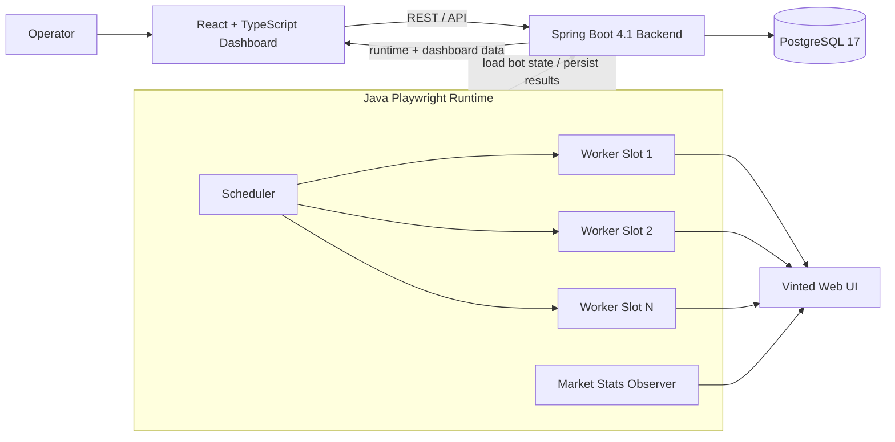

# FlipBot — Vinted Offer Tracker & Negotiation Automation

<p align="center">
  <strong>A full-stack marketplace automation system for high-signal offer discovery, persistent negotiation workflows, runtime observability and market planning.</strong>
</p>

<p align="center">
  <a href="../../actions/workflows/ci.yml"></a>
  
  
  
  
  
  
</p>

<p align="center">
  <a href="#demo">Demo</a> ·
  <a href="#architecture">Architecture</a> ·
  <a href="#core-capabilities">Capabilities</a> ·
  <a href="#running-locally">Run locally</a> ·
  <a href="#tests--ci">Tests & CI</a>
</p>

> **Status:** active development. FlipBot is an independent engineering project and is not affiliated with, endorsed by, or sponsored by Vinted. Marketplace automation may be subject to platform rules and account restrictions; anyone running it is responsible for the applicable terms and local law.

---

## Demo

<p align="center">
  <a href="https://youtu.be/xaNDLMsuKKk">
    
  </a>
</p>

<p align="center">
  <a href="https://youtu.be/xaNDLMsuKKk"><strong>▶ Watch the full FlipBot demo on YouTube</strong></a>
</p>

The video is the fastest way to see the project as a product rather than as a collection of source files. It shows the web control plane and the live browser-worker runtime working together: bot configuration and management, operational state, catalog discovery, negotiation-oriented flows and the terminal-side automation process.

The rest of this README explains the engineering behind that behavior.

---

## What is FlipBot?

FlipBot is a Java/React monorepo built around a simple idea: marketplace automation should be **stateful, observable and deliberately guarded**, not a one-off scraper that forgets everything after a browser closes.

The backend is the source of truth for bots, listings, negotiations, quotas, runtime telemetry and market statistics. A separate Java Playwright runtime continuously schedules browser jobs, discovers matching listings, verifies targets, prepares or executes negotiation steps and persists every meaningful state transition back through the API. The React application is the operational control plane for configuring and supervising the system.

In practice, FlipBot combines four different engineering problems in one project:

- **browser automation** against a dynamic client-rendered marketplace,
- **stateful workflow orchestration** for multi-step negotiations,
- **backend consistency and safety** around actions that should never be duplicated accidentally,
- **operational UI and telemetry** for understanding what every worker and bot is doing.

---

## Core capabilities

| Area | What FlipBot implements |
| --- | --- |
| **Targeting** | Explicit `VINTED_MODEL` and `SEARCH_QUERY` modes with strict model / variant verification |
| **Discovery** | Newest-first catalog scans, price guards, persisted listings and backlog processing |
| **Negotiations** | Persistent multi-step negotiation ladders, messages, counteroffer thresholds and delayed reactions |
| **Adaptive pricing** | Optional adjustment to Vinted's minimum accepted offer while preserving the configured ladder proportions |
| **Safety** | Dry-run-first operation, real-action preflight, persistent action guards, idempotency, quota reservation and per-run caps |
| **Scheduling** | Multi-worker scheduler with per-bot serialization, retry delays and rate-limit cooldowns |
| **Runtime telemetry** | Bot status, worker slot, last/next run, duration, consecutive failures and last error |
| **Market intelligence** | Baseline counts, 24-hour / 7-day activity and model-level planning metrics |
| **Persistence** | PostgreSQL-backed bots, configurations, listings, negotiation state, quotas, audit state and telemetry |
| **Security** | AES-256-GCM encryption for persisted marketplace credentials using an external key |

---

## Architecture



### Responsibility split

**React frontend**

- bot creation, editing and operational controls,
- dashboard / history / action-required views,
- runtime monitoring,
- dictionaries and model configuration,
- market-statistics / planning views.

**Spring Boot backend**

- persistent source of truth,
- validation and bot configuration rules,
- listing lifecycle and negotiation state,
- daily negotiation capacity,
- persistent real-action guards and audit state,
- runtime telemetry APIs,
- market-statistics aggregation.

**Playwright runtime**

- browser contexts and page lifecycle,
- Vinted filtering / search targeting,
- catalog scanning and listing verification,
- first-offer preparation and execution,
- negotiation follow-ups,
- seller-response observation,
- market-stat collection,
- worker scheduling and retry behavior.

**PostgreSQL**

- durable state independent of browser lifetime,
- schema managed by the migration set in `backend/src/main/resources/db/migration/`.

---

## End-to-end flow

A normal bot lifecycle is intentionally split into small, recoverable stages instead of one long browser script.

1. **Configure a bot** in the React UI: category path, brand, target mode, price range, negotiation budget and negotiation steps.
2. **Start the bot**. The scheduler discovers RUNNING bots and assigns due jobs to available worker slots.
3. **Create an isolated browser job**. Every scheduled run receives its own `BrowserContext` and page lifetime.
4. **Build the target** using either an exact native Vinted model or a search query.
5. **Scan newest-first listings**, enforce price / target guards and persist eligible discoveries.
6. **Claim work in the backend** so the same marketplace item is not independently acted on by multiple bot accounts.
7. **Prepare a negotiation action** and re-check the live item immediately before submission.
8. **Acquire persistent guard + reserve quota** only when the action is ready to be submitted.
9. **Submit and confirm** the marketplace-side result, then persist conversation identifiers, step state and audit data.
10. **Continue later**. Subsequent scheduled jobs can resume the same negotiation without relying on the old browser process or in-memory state.

This design means a worker can crash, restart or release its browser context while the business workflow remains recoverable from PostgreSQL.

---

## Targeting modes

FlipBot deliberately separates two different ways of defining what a bot is allowed to act on.

### `VINTED_MODEL`

Used when Vinted exposes the requested product as a native model filter.

The runtime:

- selects category and brand first,
- requires the model row to be proven as an **exact visible Vinted option**,
- rejects look-alike variants such as `Edge`, `Ultra`, `FE` or `+` when they are not the configured target,
- verifies the resulting `brand_collection_ids[]` value,
- treats Vinted's native classification as authoritative after the exact filter has been established.

If the exact model cannot be proven, the flow fails closed instead of silently broadening the target.

### `SEARCH_QUERY`

Used for products that do not have a suitable native Vinted model filter.

The runtime:

- submits the configured search query,
- keeps category / brand / price constraints in place,
- semantically verifies results against title, URL and — when needed — the live item page,
- rejects wrong generations, adjacent variants and common accessories.

The distinction between `VINTED_MODEL` and `SEARCH_QUERY` is preserved through discovery, statistics and negotiation verification.

---

## Stateful negotiation engine

Listings are persistent workflow entities, not disposable scraper rows.

A simplified lifecycle looks like this:

```text
DISCOVERED
   │
   ├─ price / target mismatch ─────────► SKIPPED_...
   ├─ unavailable / no contact action ─► UNAVAILABLE / CONTACT_UNAVAILABLE
   │
   ▼
NEGOTIATING
   │
   ├─ seller activity / formal response
   ├─ configured wait policy
   ├─ next negotiation step
   ├─ manual decision required ────────► ACTION_REQUIRED
   ├─ rejected / timed out ────────────► REJECTED / EXPIRED
   ├─ operator marks purchase ─────────► PURCHASED
   └─ workflow complete ───────────────► FINISHED
```

### What is persisted

For each listing / negotiation the backend can retain, among other things:

- marketplace listing ID,
- original and current price,
- current negotiation step,
- conversation ID and URL,
- whether the bot is awaiting the seller,
- current-step start time,
- seller-activity timestamps,
- formal-response fingerprint and first-detection time,
- final / skipped / action-required status.

That persistence is what lets a later worker job resume the negotiation correctly.

### Adaptive negotiation ladder

A bot configuration can define multiple ordered negotiation steps. A step can contain:

- offer price,
- maximum accepted seller counteroffer,
- optional message,
- reaction to a formal rejection,
- optional rejection wait time,
- default reaction to an unacceptable counteroffer,
- counteroffer rules based on discount relative to the **original listing price**.

FlipBot also supports an adaptive mode where the first configured offer can be raised to Vinted's minimum accepted amount. The remaining configured ladder is then scaled while preserving its relative structure, and a global automatic-offer cap prevents the adaptive flow from exceeding the operator's limit.

---

## Real-action safety model

Sending a real marketplace offer is treated as a state-changing operation, not as an ordinary click.

### Preparation before submission

For a first offer, the intended order is:

1. verify target identity,
2. verify live listing state,
3. prepare the offer form,
4. verify final price and enabled submit action,
5. acquire the persistent real-action guard,
6. reserve daily quota,
7. submit the real action,
8. confirm the resulting marketplace state,
9. persist conversation and audit information.

This keeps quota / idempotency decisions as close as possible to the real submission point.

### Dry-run first

Scheduled real actions are disabled unless the Playwright JVM is started with the explicit action flags and confirmation settings. The project also supports a **preflight-only** mode in which the runtime can navigate to and validate the final action state without clicking submit.

Production mode does **not** remove the backend safety layers. Persistent guards, quota, preflight validation, bot-level budgets and per-run caps remain active.

Other protections include:

- persistent first-offer and next-step guards,
- request-level replay / idempotency handling,
- daily offer budgets and backend capacity checks,
- explicit bot scoping for controlled runs,
- separate confirmation for continuous production actions,
- per-run real-action throughput caps,
- target, price and availability verification immediately before acting,
- rate-limit detection and cooldown,
- fail-closed handling after ambiguous post-quota failures,
- same-bot serialization across worker slots.

The full staged procedure is documented in [`playwright/REAL_ACTION_TESTING.md`](playwright/REAL_ACTION_TESTING.md).

---

## Parallel scheduler and browser isolation

FlipBot does **not** execute all bots serially in one shared browser.

The scheduler owns a configurable pool of worker slots. Different bots may run simultaneously, but the same bot is not scheduled into two worker slots at once.

Default production scheduler values are:

| Setting | Default |
| --- | ---: |
| Worker slots | `10` |
| Backend sync | `5 s` |
| Negotiation check | `120 s` |
| Catalog scan | `900 s` |
| Generic failure retry | `60 s` |
| Rate-limit retry | `600 s` |
| Shutdown timeout | `30 s` |
| Scheduler browser mode | headless |

`FLIPBOT_WORKER_COUNT` is a **concurrency cap**, not a bot-count limit. More RUNNING bots can be queued than there are browser worker slots.

### Job-level isolation

Each scheduled bot job receives an isolated `BrowserContext`. The worker JVM / Playwright runtime may stay alive between jobs, while cookies, storage and page lifetime remain isolated at the job level.

Automation flows also follow a single-main-page policy. Unexpected extra tabs or windows are closed so advertising / redirect popups cannot take over the automation flow.

---

## Runtime observability

The backend stores operational state for every bot, and the frontend exposes a dedicated **Runtime** view.

Tracked runtime data includes:

- `IDLE`, `QUEUED`, `WORKING`, `COOLDOWN` and other runtime statuses,
- last run start,
- last run finish,
- next scheduled run,
- last run duration,
- consecutive failure count,
- most recent error,
- active / last worker slot,
- telemetry update time.

That makes the scheduler observable from the UI instead of requiring the operator to infer system state from terminal logs alone.

---

## Market statistics and planning

A separate read-oriented collector measures marketplace activity per configured model.

It persists / exposes metrics such as:

- baseline offer count,
- offers observed in the last 24 hours,
- offers observed in the last 7 days,
- existing configured bot count,
- a derived recommended bot count,
- readiness / collection state.

The collector is separate from ordinary bot worker jobs and can continue gathering planning data independently of negotiation throughput.

For `VINTED_MODEL` targets it stays strict: if the exact native model filter cannot be proven, the observer fails closed rather than silently switching to broad text search.

---

## Browser resilience

Vinted is a dynamic client-rendered application, so the Playwright layer contains explicit recovery logic rather than assuming every click immediately produces the expected page state.

Examples include:

- category-selection retry and reset,
- brand persistence verification,
- exact-model row verification,
- exact model collection-ID persistence retry,
- safe navigation back to a known Vinted URL,
- popup / tab isolation,
- human-verification waiting hooks,
- unavailable-item detection,
- bounded detail-page inspection,
- graceful retry after transient failures,
- backlog processing for older persisted `DISCOVERED` items that fall off the newest catalog page.

The goal is not to hide failures. Unsafe fallbacks are rejected and important failures remain visible through structured logs and runtime telemetry.

---

## Persistence and credential security

FlipBot keeps business state in PostgreSQL rather than in browser memory.

The backend also encrypts persisted marketplace passwords with **AES-256-GCM**. The encryption key is not stored in the repository: startup requires `FLIPBOT_ENCRYPTION_KEY`, containing a Base64-encoded 32-byte key.

This separates the encrypted database value from the key needed to decrypt it and avoids committing a static credential-encryption key to source control.

---

## Tech stack

| Layer | Technology |
| --- | --- |
| Backend | Java 21, Spring Boot 4.1, Spring MVC, Spring Data JPA, Validation, Security, Actuator |
| Database | PostgreSQL 17, Flyway migrations |
| Automation | Java 21, Microsoft Playwright 1.54, Jackson, SLF4J / Logback |
| Frontend | React 19, TypeScript 6, Vite 8, React Router 7 |
| Tooling | Maven, npm, Docker Compose, GitHub Actions |

---

## Repository structure

```text
VintedOfferTracker/
├── backend/        # Spring Boot API, persistence, business rules, migrations
├── frontend/       # React + TypeScript operational dashboard
├── playwright/     # browser workers, targeting, scanner, negotiations, observer
├── docker/         # local PostgreSQL compose setup
├── docs/           # project media / documentation assets
└── .github/        # CI workflow
```

---

## Running locally

### Requirements

- Java 21
- Node.js + npm
- Docker + Docker Compose
- Maven (the backend includes a Maven wrapper)
- Chromium / Playwright browser runtime as required by your environment
- a Base64-encoded 32-byte `FLIPBOT_ENCRYPTION_KEY`

### 1. Start PostgreSQL

```bash
cd docker
docker compose up -d
```

The compose file starts PostgreSQL 17 on `localhost:5433`, with:

```text
database: flipbot
user:     postgres
password: postgres
```

### 2. Configure the backend for a clean local database

The checked-in `application.yml` currently points to the local restoration database `flipbot_pr74`, uses port `8081` and has Flyway disabled. For a clean database created by the Docker compose file, override those values before starting the backend.

Linux / macOS:

```bash
export SPRING_DATASOURCE_URL="jdbc:postgresql://localhost:5433/flipbot"
export SPRING_DATASOURCE_USERNAME="postgres"
export SPRING_DATASOURCE_PASSWORD="postgres"
export SPRING_FLYWAY_ENABLED="true"
export FLIPBOT_ENCRYPTION_KEY="$(openssl rand -base64 32)"
```

PowerShell:

```powershell
$env:SPRING_DATASOURCE_URL = "jdbc:postgresql://localhost:5433/flipbot"
$env:SPRING_DATASOURCE_USERNAME = "postgres"
$env:SPRING_DATASOURCE_PASSWORD = "postgres"
$env:SPRING_FLYWAY_ENABLED = "true"

$keyBytes = New-Object byte[] 32
[Security.Cryptography.RandomNumberGenerator]::Fill($keyBytes)
$env:FLIPBOT_ENCRYPTION_KEY = [Convert]::ToBase64String($keyBytes)
```

Keep the same encryption key for an existing database. Changing it makes previously encrypted credentials impossible to decrypt with the new key.

### 3. Start the backend

Linux / macOS:

```bash
cd backend
./mvnw spring-boot:run
```

Windows:

```powershell
cd backend
.\mvnw.cmd spring-boot:run
```

The backend runs on:

```text
http://localhost:8081
```

### 4. Start the frontend

```bash
cd frontend
npm install
npm run dev
```

Vite's development proxy forwards `/api` requests to `http://localhost:8081`.

### 5. Verify the Playwright module

```bash
cd playwright
mvn test
```

For interactive local development, run:

```text
pl.flipbot.playwright.FlipBotPlaywrightApplication
```

from your IDE after the backend is available.

Keep real-action flags disabled for ordinary development. Use the staged procedure in [`playwright/REAL_ACTION_TESTING.md`](playwright/REAL_ACTION_TESTING.md) before deliberately enabling any marketplace-side submit action.

---

## Useful Playwright runtime configuration

The most important scheduler variables are:

```text
FLIPBOT_WORKER_COUNT=10
FLIPBOT_SYNC_INTERVAL_SECONDS=5
FLIPBOT_NEGOTIATION_CHECK_INTERVAL_SECONDS=120
FLIPBOT_CATALOG_SCAN_INTERVAL_SECONDS=900
FLIPBOT_FAILURE_RETRY_SECONDS=60
FLIPBOT_RATE_LIMIT_RETRY_SECONDS=600
FLIPBOT_SHUTDOWN_TIMEOUT_SECONDS=30
FLIPBOT_SCHEDULER_HEADLESS=true
```

Real-action controls are intentionally separate from normal scheduling. In a normal dry-run / observer setup keep the action flags disabled:

```text
FLIPBOT_REAL_OFFERS_ENABLED=false
FLIPBOT_REAL_NEXT_STEPS_ENABLED=false
```

See [`playwright/REAL_ACTION_TESTING.md`](playwright/REAL_ACTION_TESTING.md) for preflight mode, explicit bot allowlists, production confirmation, throughput caps and emergency disarm behavior.

---

## Tests & CI

GitHub Actions validates the major modules on pull requests.

**Backend**

```bash
cd backend
./mvnw test
```

The backend tests require `FLIPBOT_ENCRYPTION_KEY`; CI injects a deterministic disposable key for the test process.

**Playwright**

```bash
cd playwright
mvn test
```

The Playwright test suite covers targeting, filtering, negotiation decisions, worker logic and real-action safety behavior.

**Frontend**

```bash
cd frontend
npm install
npm run lint
npm run build
```

---

## Design principles

### Fail closed on target identity

Negotiating the wrong model is worse than skipping an uncertain listing. Exact-target verification therefore rejects ambiguous matches instead of broadening them automatically.

### Persist business state outside the browser

Browser contexts are disposable. Listings, negotiation progress, deadlines, audit information and operator decisions belong in PostgreSQL.

### Prepare before reserving scarce actions

Quota and persistent guards are acquired as late as safely possible — immediately before a real submit — after the live item and final action have been verified.

### Serialize one bot, parallelize different bots

Different bots may use different worker slots concurrently, while the same bot remains serialized to avoid two jobs mutating one negotiation state at the same time.

### Distinguish UI failure from business state

A missing element during one page load is not automatically treated as a permanent marketplace outcome. Transient failures are retried; terminal statuses are reserved for states that have actually been established.

### Keep history instead of deleting it

Sold, unavailable, rejected, skipped and completed listings remain represented by explicit statuses. This preserves auditability and prevents old marketplace items from repeatedly reappearing as unknown work.

---

## Roadmap

- richer structured tracing and operational metrics,
- stronger regression coverage for marketplace UI changes,
- additional runtime / market visualizations,
- deployment-oriented environment profiles and packaging,
- screenshot gallery accompanying the YouTube demo,
- continued hardening of recovery paths around dynamic marketplace UI behavior.

---

## Disclaimer

FlipBot is an independent software-engineering project. It is not an official Vinted client and is not affiliated with Vinted. Marketplace UI, selectors, policies and account behavior may change without notice. Anyone choosing to run marketplace automation is responsible for the platform terms applicable to their account and for local law.
